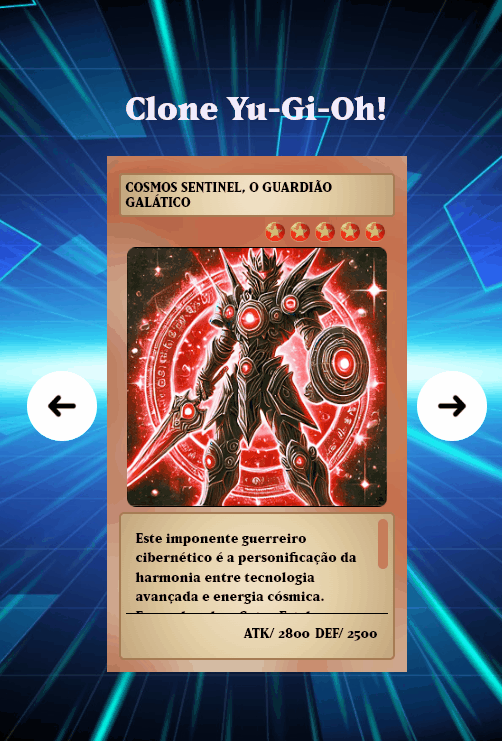

# Projeto clone Yu-Gi-Oh!
Um projeto clonando cartas do Yu-Gi-Oh! 

[](https://sthivemmartins.github.io/projeto-clone-yu-gi-oh/)

## Tecnologias utilizadas
- HTML
- CSS
- JS

## Como utilizar

1 - Clone o projeto 
````
git clone <url>
`````
2 - Acesse a pasta do projeto
````
cd repositorio-com-readme
````

[def]: image.png